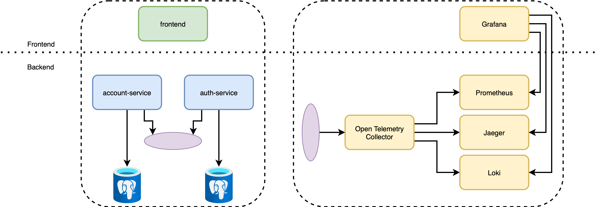

# MICRO-WISE

              

## Description
Passionate project for DevOps skill development.

## Architecture

## Observability

Stack:
- Grafana
- Loki
- Prometheus
- Jaeger

## Deployment

ArgoCD application setup with Helm charts using Terraform provider. 